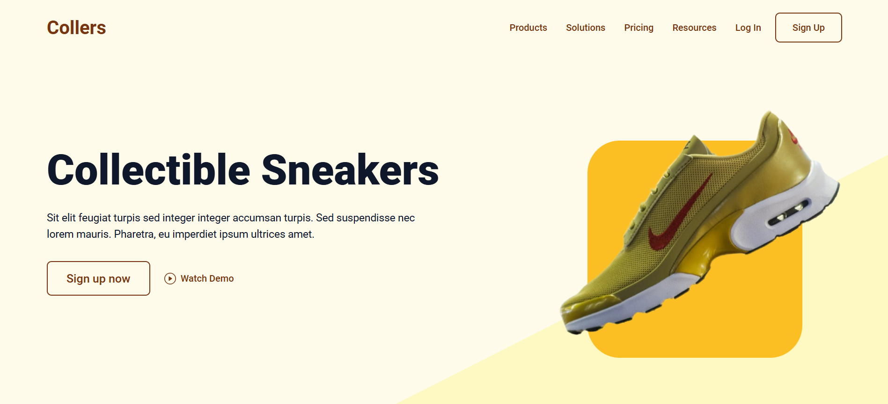
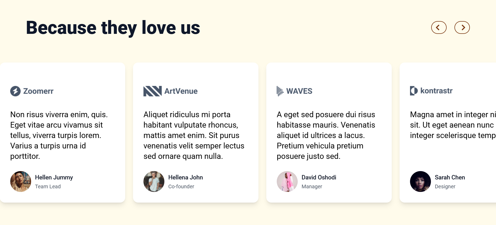
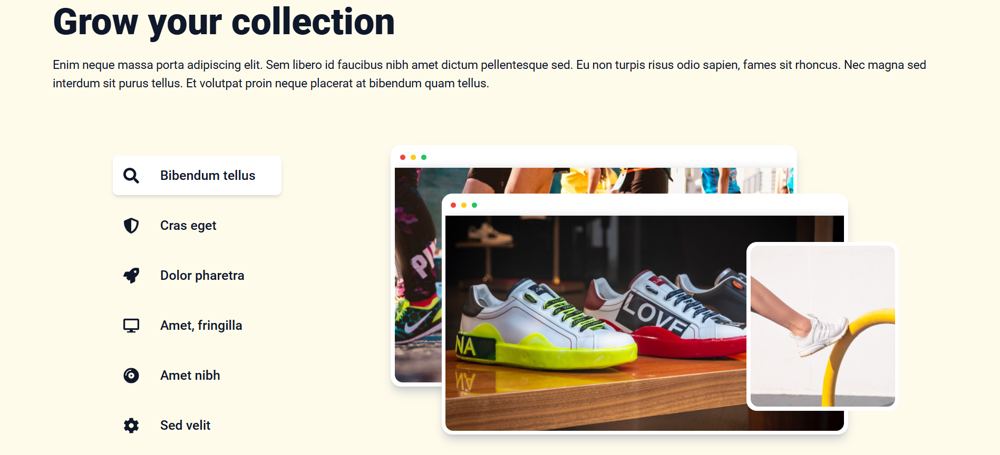

## 🌟 Responsive and Modern Landing Page

Fully **responsive** and **modern** landing page designed for showcasing features or products. Built with **React** and **Tailwind**.

### 🚀 Live Demo:

Check out the live demo: [Landing Page](https://collers-sneakers.netlify.app/)






### Installation

#### 1. Clone the repository:

```
git clone https://github.com/MihribanEvren/awesome-landing-page.git
```

#### 2. Install dependencies:

```
npm install
```

#### 3. Start the development server:

```
npm run dev
```

### 🙌 Contributing

Contributions are welcome! If you’d like to contribute to the project, feel free to fork the repository and submit a pull request.
